# MarketEase

E-Commerce Flutter Application

A fully featured E-Commerce mobile application built by using Flutter, following MVVM architecture and powered by Cubit (Bloc) for state management. The app integrates real APIs, secure authentication, and online payment systems.

🚀 Features

🏠 Home

Browse multiple categories
Explore brands
View products filtered by brand & category
Clean and responsive UI

🔐 Authentication

User Sign Up / Login
Secure authentication flow
API-based auth handling

🛒 Cart

Add / remove products
Update quantities
View total price dynamically

❤️ Wishlist

Add products to wishlist
Remove items easily
Persistent state handling

💳 Payments

Integrated Stripe
Integrated PayPal
Secure checkout experience

🏗️ Architecture

The app follows MVVM (Model-View-ViewModel) pattern:

Model → Handles data & API responses
View → UI components (Flutter widgets)
ViewModel (Cubit) → Business logic & state management

State management is implemented using:

Cubit (Bloc) for predictable state flow
🔌 API Integration
RESTful APIs integration using:
Dio
Features:
Error handling
Interceptors
Clean API structure

🛠️ Tech Stack

Flutter
Dart
Cubit (Bloc)
Dio
MVVM Architecture
Stripe SDK
PayPal Integration

## ScreenShots

## Splash screen

 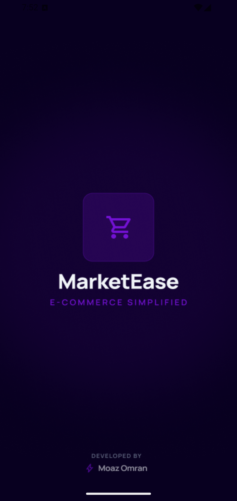 

## Authentication

  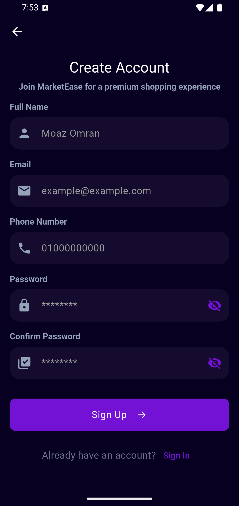 

## Onboarding

    

## Home

 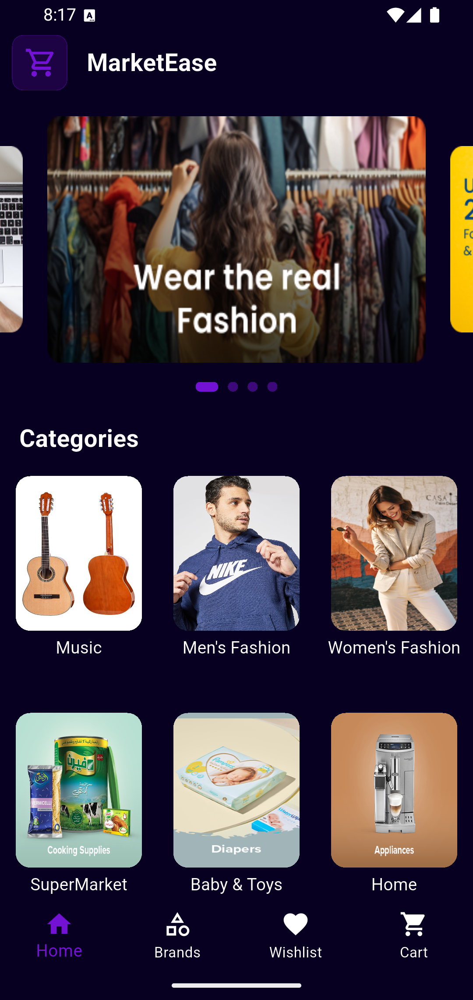 

## products

 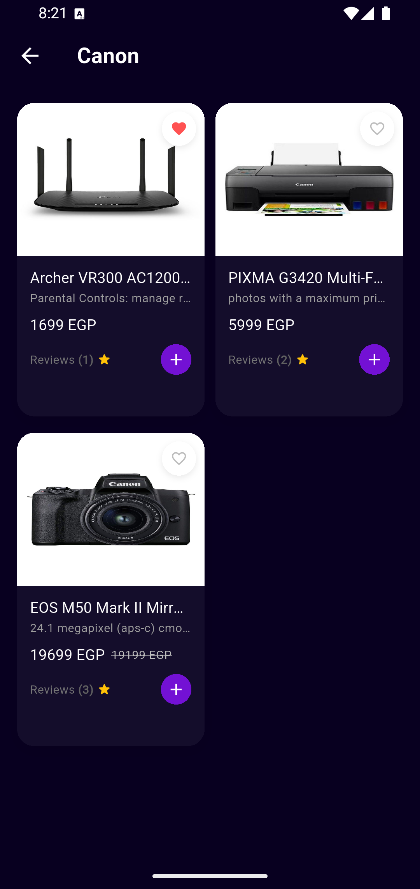 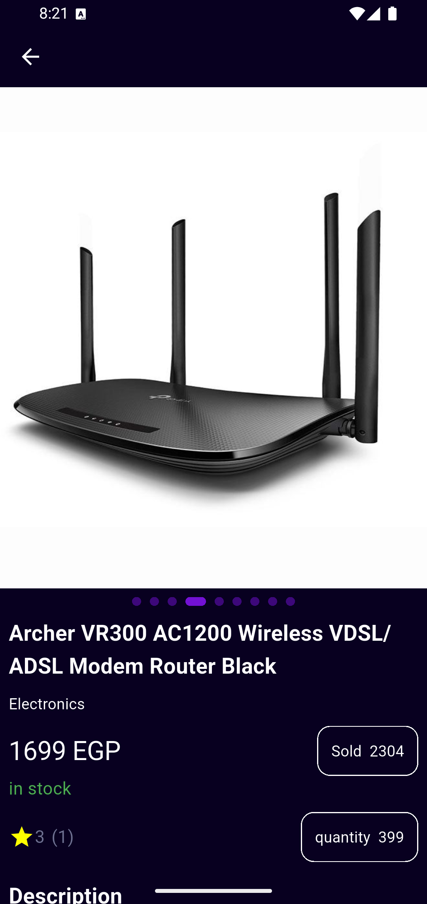 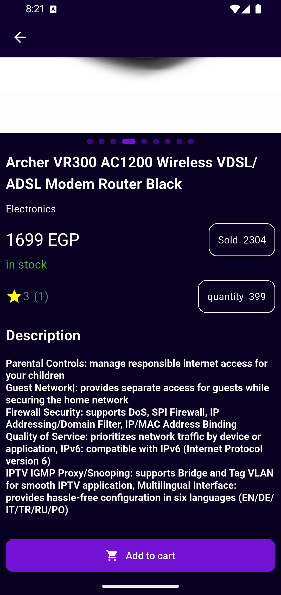 

## Brands

 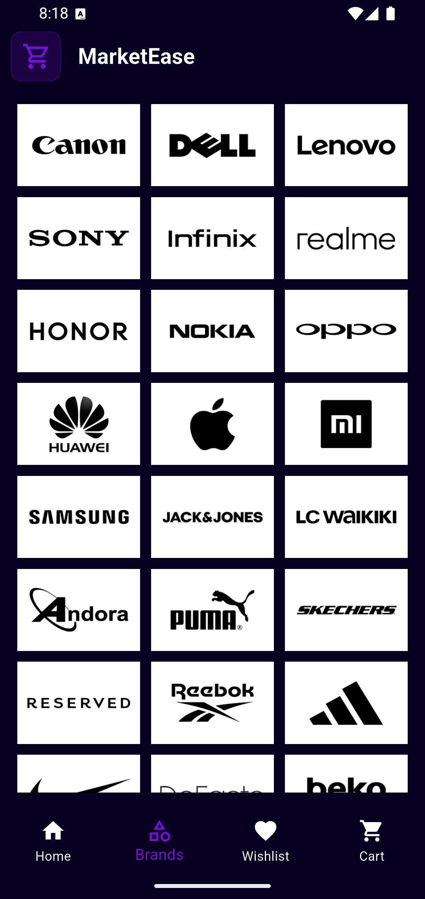 

## wishList

 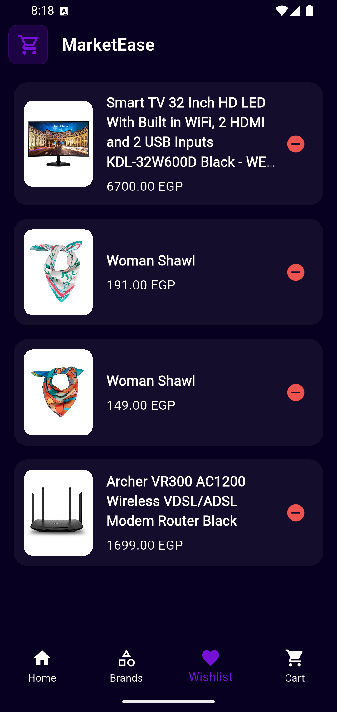 

## Cart

 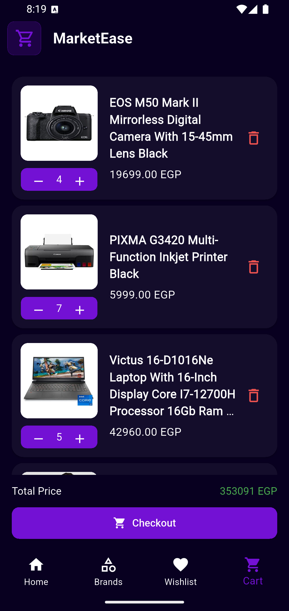 

## payment

 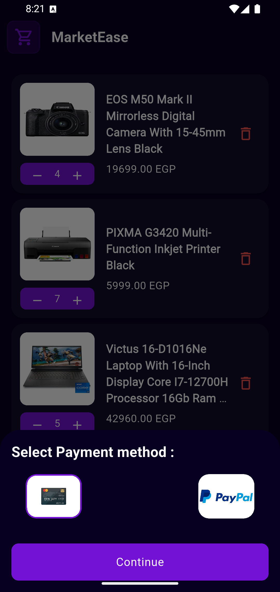 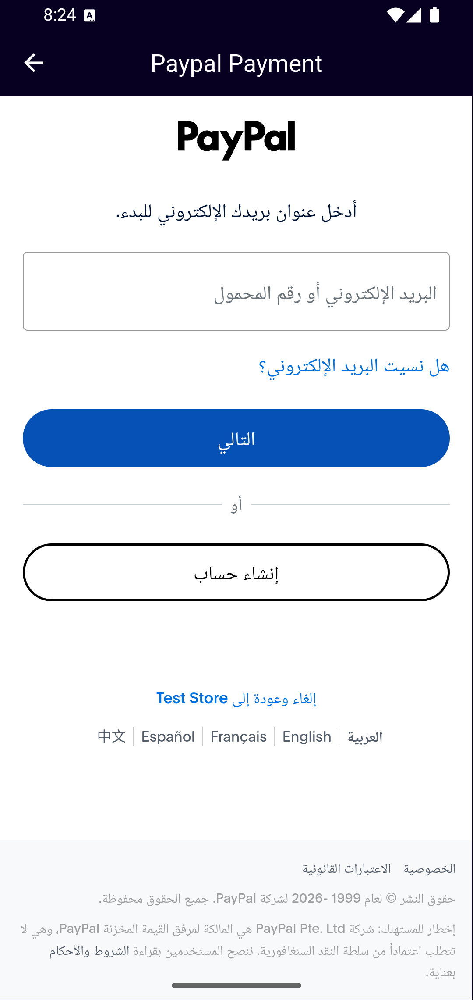 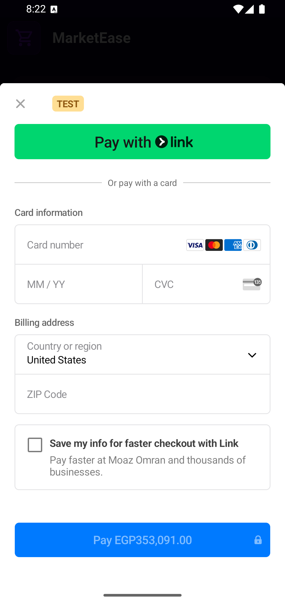 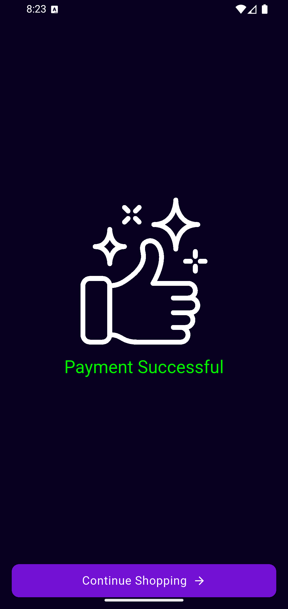 

